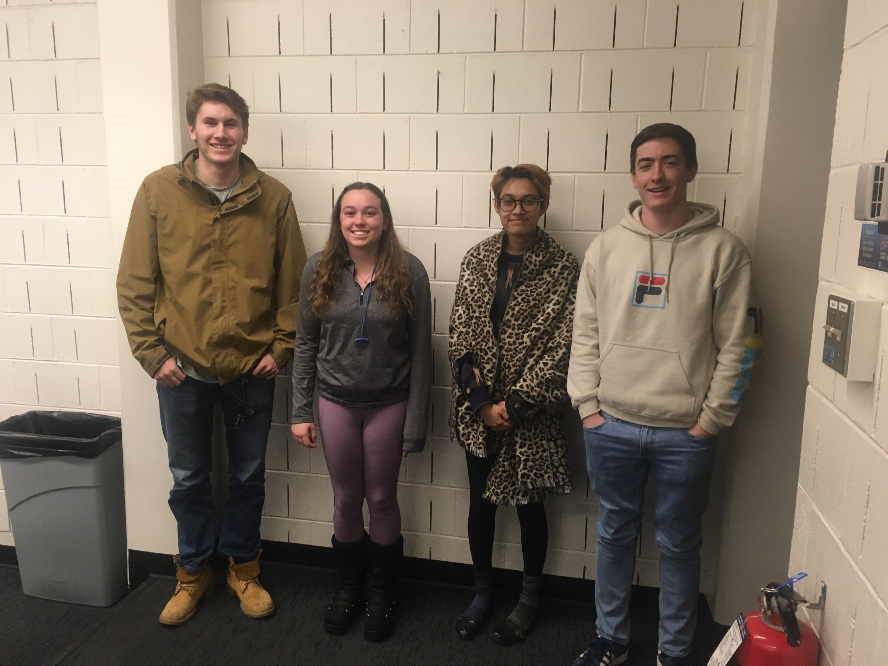
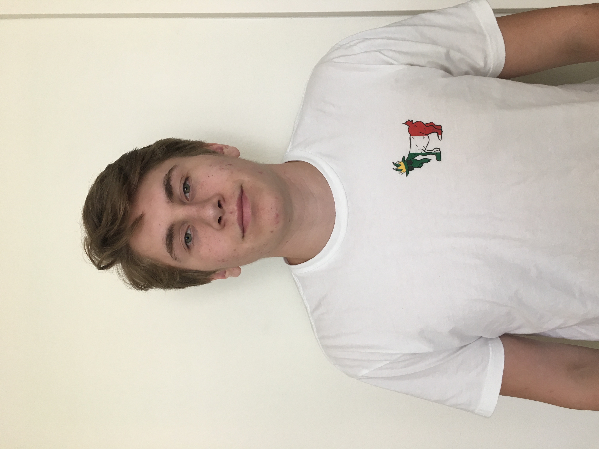

=======
---
title: "Lab Assignment 2"
author: "Shreeya Basrur"
date: "January 23, 2019"
output: html_document
---

Team Lil Rascals
image:
Team Goal: To learn how to effectively collaborate using github and rstudio.

About Me

Shreeya Basrur
image:
I found the database of all the last words for texas's death row from 1980 to today. My question is how positive or negative are most people's last words?

6 months after graduation I would like to be either working or in grad school. The ideal would be that I would move out of colorado and experience other parts of the country. I would want to be some sort of programmer or data person ideally. After 5 years I would want to work at company that is a chill place to work. 

I don't know what my greatest career achievement would be because I don't really know what I want to do career-wise. 

I want to learn R, of course, and how to work with data to make conclusions. I also want to gain the skills I would need to get an internship to work with data to see if that's what I want to do career-wise.

Miscellaneous stuff about me: I work for the environmental center on the eco-social justice team  and as an applied math learning assistant which are both jobs that I love. I also play the violin in the campus orchestra. 

Feedback: Kelsey: I loved how thorough and long your answers were. You really went into details. I don't really have anything negative or constructive to add. 

James Burke 
image: 
I would like to know how effective tutoring truly is because there is a lot of bias involved.
 
6 months after graduation I would like to get a job analyzing big data and creating algorithms to based on that analysis.
 
I'm not exactly sure what I hope my greatest career achievement would be but most likely helping to make some sort of process related to the tech industry more efficient and or affect.
 
I would like to get a solid base of statistics and R knowledge that would help me analyze data.
 
Miscellaneous stuff about me: I am a big european sports fan and support the Glasgow Celtic, which is my dad's hometown team growing up.

Feedback: 
Shreeya: You could number your questions to be more clear so Dr. Vance can grade easier. 
Kelsey: I think your intentions for this class are good. I think numbering the questions would help organize it also!
```{r setup, include=FALSE}
knitr::opts_chunk$set(echo = TRUE)
```

image:

Question 1: How can we best condense large scaled data to eliminate outliers? 
Question 2: In six months I am eager to be in Africa with the peace corps teaching math to middle and high schoolers. In five years, I want to be in graduate school studying something that I am passionate about. 
Question 3: I hope my greatest career accomplishment will be one that I will never see or that I have made an enormous impact on someone. I am hoping to pursue a field that allows me to help and work with others. 

I used to be in the circus as a child!
Feedback:
Shreeya: You could elaborate more about your fun fact so we can learn more about you. For example, what did you do in the circus?

Matthew Copeland
image:

Q1: What really came first the Chicken or the egg?
Q2: Six months after graduating I wish to be going back to Alaska to discover what I want to do. Then after five years hopefully I find a job that I enjoy doing and can make a living.
Q3: I hope my greatest career accomplishment would to have lion statues at the beginning of my driveway. And through this course I hope to learn key skills to make me stand out in the workforce. 
-In Moab, Utah I almost died going 4x4 driving in the canyon. 
Feedback:
Shreeya: I think you could also elaborate on your fun fact so we can learn more about you. I want to hear more of this story. 
Kelsey: I think your first question is funny! I can't believe you almost died. Your work looks good and I enjoyed learning about you.
>>>>>>> master

=======

